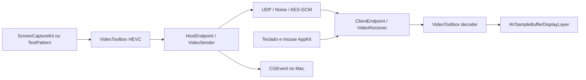

# Revisão do Lightray antes do cliente Windows

Data: 28/09/2026.
Este documento registra a baseline anterior às correções; o estado atual está no [registro de execução](../../windows/foundation-progress.md).
Conclusão: existe uma base funcional e testável de streaming Mac → Mac, mas ela ainda é uma implementação parcial do protocolo e precisa de correções de robustez antes de servir como referência para um segundo cliente.
O desenvolvimento Windows deve começar pela interoperabilidade com esta implementação, com critérios de saída verificáveis em cada etapa.

## Entregáveis e estado

- [Plano de implementação por etapas](../../windows/implementation-plan.md).
- [Plano de testes, métricas e laboratório RTX 4090](../../windows/validation-plan.md).
- [Evidências executadas e instruções de reprodução](evidence/README.md).

Esta revisão adiciona documentos e um executável de diagnóstico isolado.
Nenhum arquivo original do produto foi alterado, e nenhum cliente Windows foi implementado nesta etapa.
As falhas descritas abaixo continuam abertas; reproduzi-las não equivale a corrigi-las.

## Base examinada

O diretório recebido não contém `.git`.
Após o usuário informar a origem, comparei os 73 arquivos de documentação, código e fixtures inventariados com a `main` de [diogoviannaaraujo/lightray](https://github.com/diogoviannaaraujo/lightray/tree/5002116872492da705aa6252f26482b02e3df5b5).
Todos os 73 são idênticos, byte a byte, ao commit `5002116872492da705aa6252f26482b02e3df5b5`.
O manifesto não inclui `.gitignore`, arquivos de sistema nem resultados de build.
A correspondência está em [upstream-comparison.json](evidence/upstream-comparison.json), e os hashes em [source-manifest.json](evidence/source-manifest.json).

Também consultei a branch `windows-validation`, no commit `d38aaade7936660f62bc4b52a230cbd7dc78f2af`.
Ela contém um [brief de pesquisa](https://github.com/diogoviannaaraujo/lightray/blob/d38aaade7936660f62bc4b52a230cbd7dc78f2af/tools/windows/BRIEF.md), um rascunho de probe NVENC e três streams HEVC de referência com manifests.
O próprio brief registra que o probe não foi compilado nem executado no Windows e que faltam `main.cpp` e `CMakeLists.txt`.
Não encontrei resultados Windows nem `notes/windows-client.md` nessa branch.

O foco principal daquele brief é um **host Windows**; o cliente Windows aparece em P2-2.
Para esta tarefa, P2-2 passa a ser uma das primeiras validações, enquanto captura de desktop Windows e NVENC permanecem pesquisa de host, fora do caminho crítico do cliente.
As instruções antigas de publicar a branch são contexto da pesquisa, não uma autorização desta revisão para publicar mudanças.

O acesso foi localizado pelos documentos e memórias do Next GoLev.
A memória aponta os aliases `rtx4090` para Windows nativo e `rtx4090-wsl` para WSL (memória: gpu-box-infra, 31/08/2026); a verificação atual do Tailscale confirmou o nó Windows `RTX-4090` online.
As conexões SSH foram recusadas por ausência de chave de host conhecida no Mac, antes da autenticação.
A confirmação da impressão digital foi solicitada ao usuário; nenhuma verificação de identidade foi desativada.
Logo, presença no Tailscale está verificada, mas versão do Windows, driver, monitores e ferramentas instaladas ainda não estão inventariados nesta revisão.

## Arquitetura atual

| Camada | Responsabilidade observada | Consequência para Windows |
| --- | --- | --- |
| `LightrayCore/Wire` | Serialização big-endian, handshake Noise, AEAD, replay, chunks e frame header | Boa fronteira para testes comuns e implementação sem I/O |
| `LightrayCore/Transport` | Streams confiáveis, ACK, RTT, feedback e validação de mudança de endereço | Preservar semântica e limites; não substituir por TCP para facilitar o porte |
| `LightrayCore/Media` | Fragmentação, Reed–Solomon, NACK, ordenação e recuperação por IDR | Reutilizar corpus e confrontar cada resultado; não assumir que outra biblioteca RS usa a mesma matriz |
| `LightrayCore/Session` | Uma sessão, múltiplos streams, handshake/reconexão e mensagens de entrada | Manter estado independente de GUI, socket e relógio real |
| `LightrayMac` | Socket Darwin, CryptoKit/Security, armazenamento e VideoToolbox | A implementação atual depende de APIs Apple |
| Executáveis Mac | Captura, injeção, janelas, menus e filas de trabalho | Requer adaptadores Windows; a interface AppKit não é portável |
| `tools/vectors` | Vetores gerados, exemplos e checagem documental | Base independente para conformidade; também depende de CryptoKit para gerar |

A separação entre estado do protocolo e I/O é o principal ponto favorável do projeto.
Os endpoints recebem datagramas e tempo e devolvem eventos e datagramas, permitindo simulação determinística.
Há testes externos de referência para Noise e X25519, além de comparação dos exemplos publicados.
A recuperação por FEC, retransmissão e IDR já tem simulação com perda, jitter e pausas de rádio.

## O que existe e o que ainda é desenho

| Recurso | Código atual | Situação para o primeiro cliente Windows |
| --- | --- | --- |
| Noise NNpsk0 / AES-256-GCM / replay de 2048 pacotes | Implementado e coberto por testes | Obrigatório |
| HEVC Main, 8-bit, 4:2:0, sem reordenação | Encoder Mac atual; decoder recebe configuração em IDRs | Perfil inicial obrigatório |
| Até vários displays, um stream por janela | Implementado; cliente propõe quatro por padrão | Começar por um, depois dois/quatro |
| Teclado HID 0x07, ponteiro absoluto, botões e scroll | Implementado com payloads provisórios | Reproduzir bytes; mapear semântica Windows → Mac |
| FEC Reed–Solomon | Implementado com formato provisório e porcentagem fixa | Primeiro sem FEC, depois interoperabilidade completa |
| Mudança de porta/IP do cliente | Coberta por simulação | Revalidar no Winsock e em rede real |
| Pausa por silêncio | Host pausa após 2 s, expira após 60 s; cliente recomeça após 5 s sem host | Não equivale a PARK/RESUME |
| PARK/RESUME e retomada de identidade | Não implementados | Não anunciar; evolução posterior coordenada |
| Áudio e microfone | Não implementados | Dependem também do host e da definição do wire format |
| Adaptação de bitrate/congestionamento | Ausente; taxa fixa por stream | Limitação explícita do primeiro marco em LAN |
| Cursor separado, mouse relativo, gamepad, texto UTF-8 | Ausentes | Não declarar perfil GAME completo |
| HDR, chroma avançado, LTR, reference epoch | Documentados como evolução; não implementados no caminho atual | Usar fixtures de laboratório; não habilitar por presunção de suporte da GPU |
| Instalação, atualização, CI e distribuição | Não encontrados na árvore revisada | Precisam entrar no plano de produto Windows |

## Validações realizadas

Ambiente: Apple M5 Pro, 24 GiB de RAM, macOS 26.6.1, Swift 6.4.
Os dados completos estão em [environment.txt](evidence/environment.txt).

| Comando/ensaio | Resultado | Alcance |
| --- | --- | --- |
| `swift test --package-path macos` | 64 testes passaram (59 core + 5 adaptadores) | Wire, sessões simuladas, mídia/FEC, pairing, socket local e VideoToolbox |
| `swift test --package-path tools/vectors` | 11 testes passaram | Vetores Noise/X25519 e funções do gerador |
| `swift run --package-path tools/vectors lightray-vectors check` | 15 blocos, zero problemas | Exemplos, links e fixtures verificados pelo gerador |
| `swift build -c release --package-path macos` | Passou | Compilação dos executáveis Mac |
| Probes desta revisão | Cinco comportamentos reproduzidos | Casos ausentes da suíte atual, descritos abaixo |
| Paridade inválida em subprocesso | Encerramento por sinal 5, `exit_code=-5` | Crash reproduzido sem abrir rede nem usar pairings reais |

Os testes de sessão simulam payloads e notificam sucesso de decode; não medem apresentação real nem qualidade visual de um stream completo.
O ensaio VideoToolbox existente usa 320×240 para encode/decode, além do IDR publicado de 16×16.
Não foram medidos FPS, latência fim a fim, WAN, Wi-Fi real, captura interativa, consumo sustentado nem soak na RTX.
O teste de 16×16 não deve ser o único gate Windows: a documentação do decoder HEVC da Microsoft informa mínimo de 48×48, portanto é necessário acrescentar clips de resolução suportada.
Fonte: [decoder HEVC da Microsoft](https://learn.microsoft.com/en-us/windows/win32/medfound/h-265---hevc-video-decoder).

## Achados reproduzidos

P1 significa corrigir antes de ampliar o cliente; P2 significa corrigir antes do marco que exercita o comportamento.
Os probes estão em [main.swift](evidence/probes/Sources/ReviewProbes/main.swift), com saída em [probes.log](evidence/probes.log).

| ID | Prioridade | Evidência e gatilho | Impacto | Correção e prova esperadas |
| --- | --- | --- | --- | --- |
| R01 | P1 | `Chunks.swift:141` valida `lastLength` apenas em fragmentos de dados; paridade com `count=1`, `stride=64`, `lastLength=65` é aceita; `VideoReceiver.swift:202` executa `removeLast(-1)` após recuperar o bloco | Encerramento do cliente por frame malformado; o caminho de rede exige pacote autenticado | Validar os parâmetros FEC em ambos os tipos antes de alocar/recuperar; testar 0, stride, stride+1, parity-first e fuzz; nenhum trap |
| R02 | P2 | `FrameHeader.swift:106` aceita VPS/SPS/PPS vazios; o probe confirmou a aceitação | Configuração inválida chega ao adaptador de codec, que usa ponteiros forçados em `VideoDecoder.swift:68` | Recusar configuração vazia/inconsistente e payload/NAL inválido com erro controlado; o probe não demonstrou crash do decoder |
| R03 | P1 | `VideoReceiver.swift:477` limita NACK por quantidade fixa; `Connection.swift:350` não divide um chunk maior que o limite; o probe gerou 284 bytes com máximo negociado de 256 | Recuperação pode emitir UDP além do contrato e falhar justamente no caminho restrito | Calcular entradas pela capacidade real, dividir NACKs e impedir qualquer envio acima do máximo; testar MTUs 256, 512, 1200 e 9000 |
| R04 | P1 | `ReliableSender` recusa a mensagem 1025; `ClientEndpoint.swift:250` ignora o retorno; o probe entregou 1024 presses e zero releases | Uma tecla/botão pode permanecer pressionado enquanto a sessão continua recebendo tráfego | Propagar backpressure/erro e garantir liberação/reset de input; testar fila cheia, perda unidirecional, ACK atrasado e desconexão |
| R05 | P2 | Pacote autenticado vindo da nova porta atualiza `connection.peer`, mas `ClientApp.swift:132` envia para `endpoint.config.host`; probe confirmou a divergência 7374/7373 | Rebinding do host aceito pelo core não altera o destino real de envio do cliente | Definir se o perfil admite migração do host e usar o destino efetivo por datagrama; testar ambos os sentidos, IP e porta |

R01 foi confirmado até o encerramento do subprocesso, registrado em [parity-crash.log](evidence/parity-crash.log).
Não é uma demonstração de ataque por datagrama sem autenticação: a validação AEAD antecede o parser no fluxo normal.
R02 comprova a lacuna de validação, sem afirmar uma falha de memória que não foi executada.

## Achados por inspeção

| ID | Prioridade | Evidência | Risco e ação |
| --- | --- | --- | --- |
| R06 | P1 | `VideoReceiver` permite 128 slots com até 32 MiB cada, sem orçamento agregado; `ReliableReceiver` permite 1024 mensagens e aloca um array por `segCount` antes de limitar os bytes acumulados | Tetos individuais ainda permitem consumo de vários GiB; definir orçamento por stream/sessão, limitar segmentos/metadados e testar sem provocar OOM real |
| R07 | P1 | `StreamWindow.swift:39` enfileira todo frame em `queue.async`; `waiting` apenas evita exibir quadros antigos e não limita a fila | Decoder mais lento que a origem acumula latência/memória; criar limite por tempo/bytes, descartar somente com regra de dependência e pedir IDR quando necessário |
| R08 | P2 | `StreamDecoder.invalidate` entra atrás do trabalho antigo; `ClientApp` reporta resultados assíncronos ao `endpoint` corrente sem geração da sessão | Callback de decoder antigo pode afetar sessão nova; introduzir token de geração/cancelamento; validar com reconexão e backlog, ainda não reproduzido em execução |
| R09 | P2 | `ClientApp.swift:204` calcula FPS por decode; bitrate é total da conexão, repetido em cada janela; contadores locais não são reiniciados ao trocar sessão | Métricas inadequadas para comparar Windows e possíveis deltas negativos após reconnect; separar contadores, registrar resets e medir apresentação |
| R10 | P1 para WAN | `HostOptions.encoderBitrate`, `VideoSender.Pacer` e `macos/README.md` mostram taxa fixa por stream; retransmissões não têm orçamento global e o pacer acelera com backlog | Não há controlador nem circuit breaker exigidos pelo desenho v1; cliente sozinho não corrige congestionamento do host |
| R11 | P2 | `UDPSocket.swift` ignora resultados de `setsockopt`; qualquer falha de receive encerra o loop como se fosse EAGAIN; send só incrementa contador | Perda de diagnóstico de MTU/buffer/socket; distinguir erros recuperáveis, fatais e capacidade real aplicada |
| R12 | P2 | Pairing é um token que contém a PSK, salvo em texto com permissão 0600 e aceito por argumento de processo | Windows deve ter armazenamento por usuário protegido e entrada que não exponha token em linha de comando/log; testar corrupção, troca e remoção |
| R13 | P1 de planejamento | `docs/input.md:82` manda preservar reliable state; a seção de input em `:273` manda descartar input não confirmado antes de RESUME; ainda há blocos v0/v1 | Resolver e explicitar regras específicas por stream/versão antes de implementar retomada; não portar instruções contraditórias literalmente |
| R14 | P2 de entrega | Ausência de CI, contrato de build Windows, política de versões/dependências e arquivo de licença na `main` consultada | Estabelecer checks, artefatos reproduzíveis e esclarecer condições de distribuição antes da publicação |

Os limites nominais de R06 são análise de estrutura, não uma medição de consumo real nem prova de que todos os máximos ocorram simultaneamente.
Há ainda pontos de concorrência a exercitar com sanitizers: callbacks de encoder/captura e objetos `@unchecked Sendable` executados em targets configurados no modo Swift 5.
Não classifiquei toda ocorrência de `try!` como bug: várias vêm depois de uma checagem de comprimento suficiente.

## Decisões para o porte

1. Fixar um perfil de compatibilidade com o commit auditado: handshake v1 e payloads provisórios explicitamente versionados na documentação do perfil.
2. Corrigir primeiro R01, R03, R04 e limites/filas de R06/R07, com testes que falhem antes e passem depois.
3. Usar Mac como host de referência e RTX como cliente nativo Windows; testes em WSL não homologam Media Foundation, Winsock ou DXGI.
4. Avaliar uma aplicação nativa C++20, Winsock, D3D11/DXGI e decoder substituível; decidir o compartilhamento do core num experimento limitado antes de duplicá-lo.
5. Avaliar Media Foundation e FFmpeg/D3D11VA com o mesmo corpus; NVDEC direto é uma alternativa específica NVIDIA a considerar somente se os resultados justificarem.
6. Não presumir um porte trivial de CryptoKit: o README atual do Swift Crypto anuncia Linux e Windows ARM64, e o Windows x64 precisa de prova de build e execução para a combinação escolhida.
7. Separar marcos de cliente desktop compatível, adaptação WAN e protocolo futuro com áudio/retomada avançada.

As recomendações de stack são inferências de engenharia sujeitas aos experimentos do plano.
Swift oferece [suporte de plataforma Windows](https://www.swift.org/platform-support/), mas a dependência concreta deve ser verificada no [Swift Crypto](https://github.com/apple/swift-crypto) e a ponte deve respeitar as [restrições de interoperabilidade C++](https://www.swift.org/documentation/cxx-interop/status/).
O caminho D3D11 permite compartilhar dispositivo entre decoder e renderizador, conforme a [documentação da Microsoft](https://learn.microsoft.com/en-us/windows/win32/medfound/supporting-direct3d-11-video-decoding-in-media-foundation).

## Limites da conclusão

Esta é uma revisão técnica da base disponível, com testes locais e reproduções dirigidas; não é uma certificação de segurança nem uma homologação Windows.
A RTX 4090 não representa Intel, AMD, GPUs integradas ou PCs de menor capacidade.
As medições antigas em `notes/` são evidências históricas em outras máquinas e não metas já alcançadas por este checkout.
O próximo item executável está definido no plano: concluir a identidade SSH, inventariar o Windows e preparar um checkout de desenvolvimento com baseline fixada.
